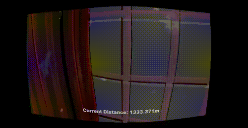
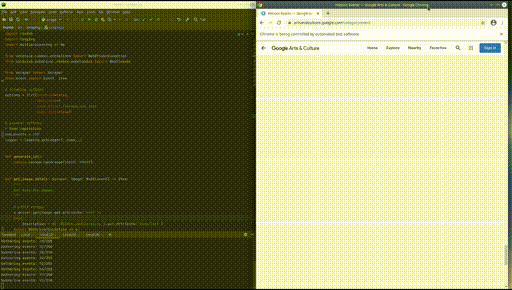
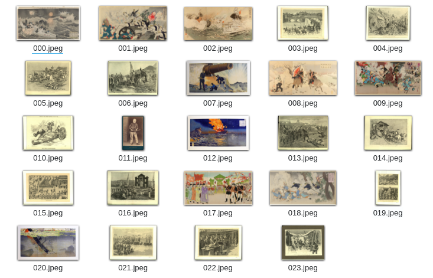
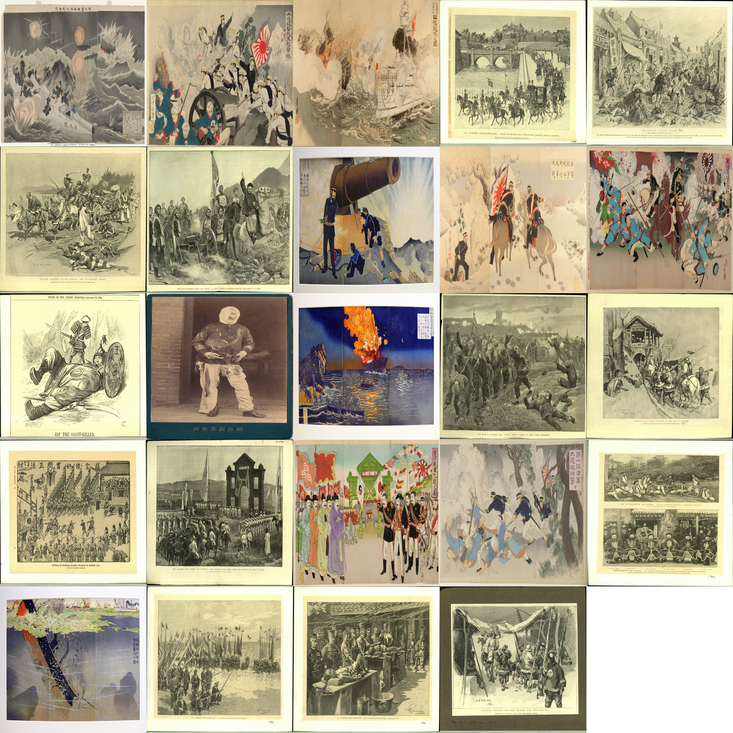

# Huma History Museum

## Overview 

Welcome traveler! Huma is a four-dimensional museum where you can explore the defining events of humanity’s history. Each of several hundred planets correspond to a major historical event, including the World Wars, the French Revolution, and the Apollo Moon Landing. Time extends along one axis and geographical space on the other two. This project was built with [Unity](https://unity.com/) using data collected from [Google Arts and Culture](https://artsandculture.google.com/). The idea for Huma was inspired by the [Tesseract](https://interstellarfilm.fandom.com/wiki/Tesseract) from Interstellar.




## Getting the Data

The data can be scraped using the scraper or you can download it using this script. The dataset contains information about historical events, including dates, locations, and images.

```bash
url=data.aru.ai/huma;curl -s $url || curl -o $url
```

## Running the Code

### Prerequisites

Please install python 3.X and project requirements. Place [chromedriver](https://chromedriver.chromium.org/) in your path and run scripts inside the `/src` directory.

### Scraping

Run `python scrape.py` to start collecting data. It will open up three windows. Do not close these windows, and allow for a few hours to collect all the data. The script should periodically output a binary file `saved_data.pkl` (for recovery purposes) and the `saved_data.json` file when complete.



### Cleaning

Once data is collected, it is prepared to be used in production. Run `python runner.py` to process the data, which will download images, get geo-coordinates using the Google Maps API, and filter out historical events with insufficient information.

**Example event after preprocessing**

```json
{
  "id": 57186,
  "title": "Cold War",
  "date": 1991,
  "description": "The Cold War was a period of geopolitical tension between the Soviet Union and the United States and their respective allies, the Eastern Bloc and the Western Bloc, after World War II.",
  "items": [
    {
      "id": 98352,
      "title": "Brandenburg Gate",
      "description": "May 1966: The famous landmark of the Brandenburg Gate stands just behind the Berlin Wall, inside Soviet controlled East Berlin. (Photo by John Waterman/Fox Photos/Getty Images)"
    }
  ],
  "Coords": {
    "lat": 14.058324,
    "lng": 108.277199
  }
}
```

### Generate

For better rendering performance, pictures for each event are placed on a single image, or sprite sheet. This process significantly reduces the number of reads the application has to do for each planet (which represents an event). `generate.py` handles this conversion.

| Input | Output |
| ------|------------ |
  | 

